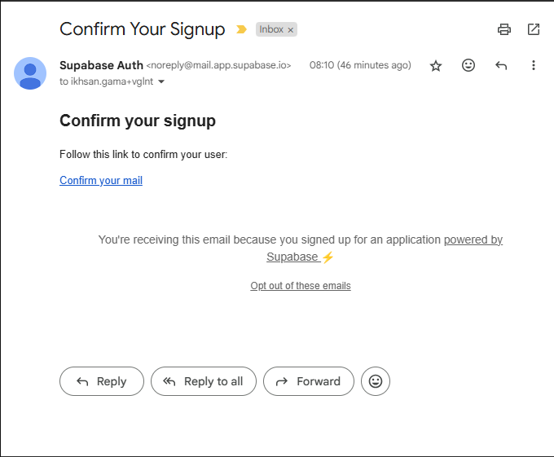
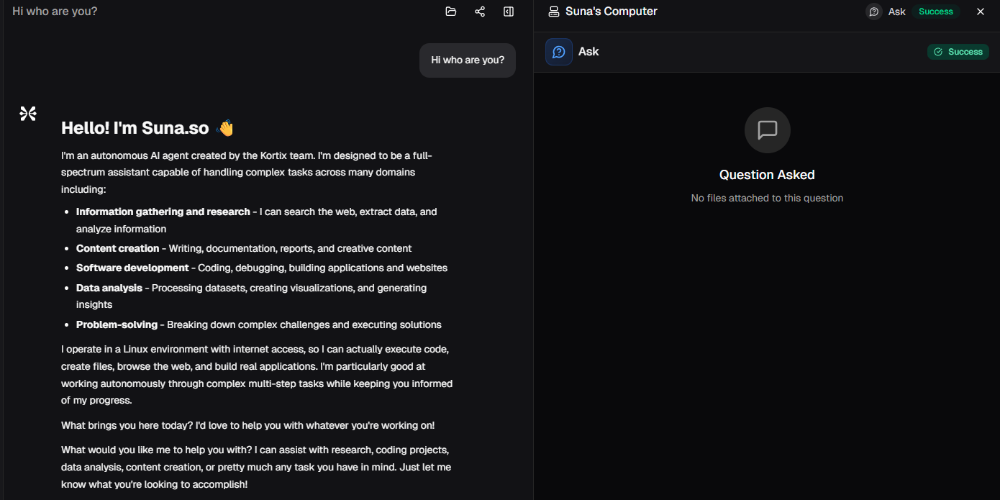
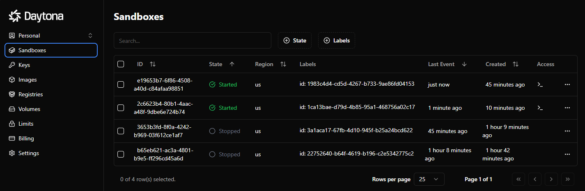
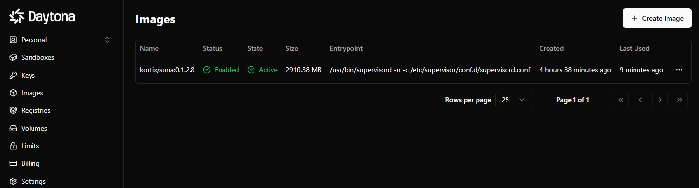
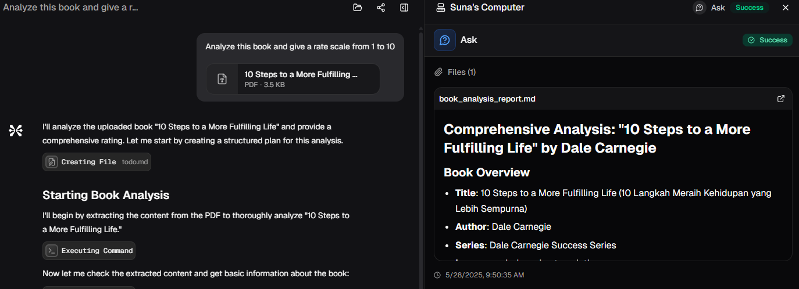
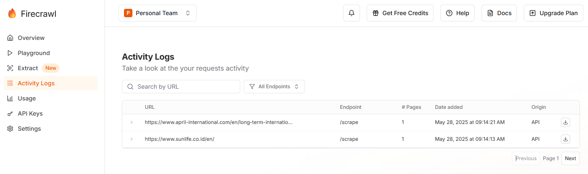
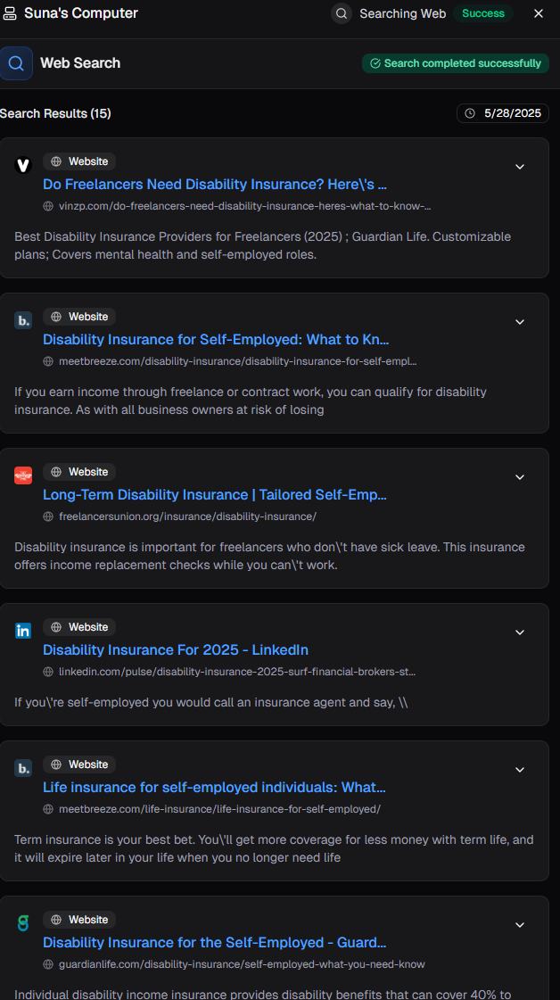
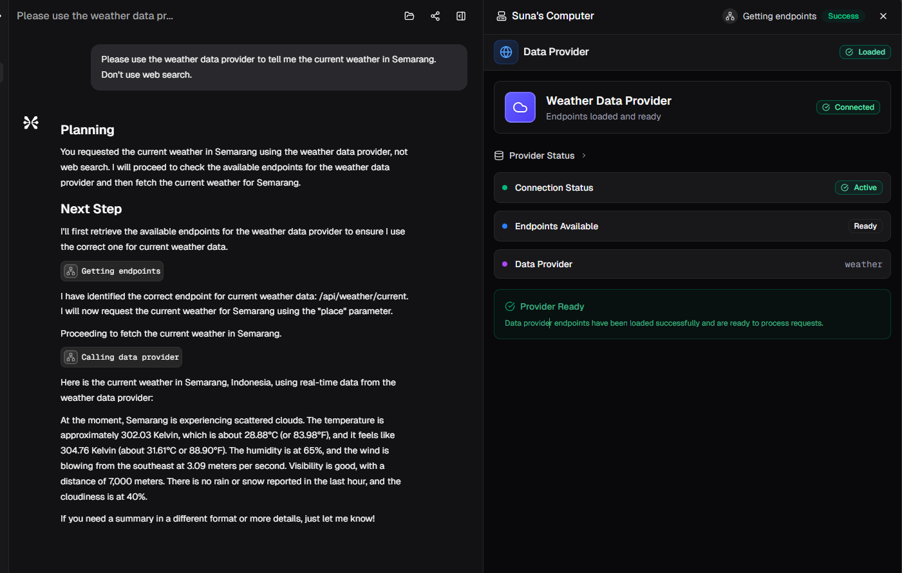

# Day 1: Environment Setup and Basic Configuration

## Morning (4 hours)

### 1. Prerequisites Setup (1.5 hours)
- [x] Set up development environment with Python 3.11 and Node.js
- [x] Install Docker and Docker Compose
- [x] Request access for accounts to the required services:
  - Supabase (database and authentication)
  - Upstash or local Redis instance
  - Daytona (agent execution environment)
  - Anthropic API (for Claude integration)

### 2. Repository Setup (1 hour)
- [x] Fork the Suna repository to your GitHub account
- [x] Clone the repository locally
- [x] Examine the project structure and documentation
- Frontend
  - **`/app`**: Contains the application routes using Next.js App Router
    - **`/auth`**: Authentication-related pages (login, signup, reset password)
    - **`/(dashboard)`**: Dashboard and authenticated user routes
      - **`/dashboard`**: Main dashboard page
      - **`/agents`**: Agent management pages
      - **`/(teamAccount)/[accountSlug]`**: Team-specific pages
    - **`/invitation`**: Team invitation acceptance page

  - **`/components`**: Reusable UI components
    - **`/basejump`**: Team management components
    - **`/thread`**: Conversation thread components
    - **`/ui`**: Basic UI components (buttons, cards, etc.)

  - **`/hooks`**: Custom React hooks
    - **`/react-query`**: Data fetching hooks organized by feature

  - **`/lib`**: Utility functions and services
    - **`/actions`**: Server actions for form submissions
    - **`/supabase`**: Supabase client configuration

  - **`/contexts`**: React context providers
  - **`/providers`**: Application providers (Auth, React Query, etc.)
- Backend
  - **`/agent`**: Core AI agent implementation
    - **`/sample_responses`**: Teach AI with sample response as reference
    - **`/tools`**: Various tools
      - **`/data_providers`**: For different services with API calls from RapidAPI
  - **`/agentpress`**: Manage AI agent interactions and execution, like how to handle context and thread
  - **`/docs`**: Document files
  - **`/logs`**: Generated logs by agentpress system
  - **`/sandbox`**: To create a Docker-based virtual environment (host in Daytona) that agents use as their own computer to execute tasks, access the web, and manipulate files
  - **`/services`**: Core infrastructure service (llm, supabase, redis, billing, langfuse)
  - **`/supabase`**: Migration files, supabase config, etc
  - **`/utils`**: Authentication, file handling, logger, S3 upload, config managements
- [x] Read through the README.md and understand the architecture

### 3. Service Configuration (1.5 hours)
- [x] Create and configure Supabase project
- [x] Set up Redis instance (via Upstash or Docker)
- [x] Configure Daytona workspace
- [x] Obtain necessary API keys (Anthropic, Tavily, Firecrawl)

## Afternoon (4 hours)

### 4. Environment Configuration (2 hours)
- [x] Configure backend .env file with all required credentials
- [x] Configure frontend .env.local file
- [x] Set up Supabase database schema using migrations
- [x] Verify all service connections

### 5. Initial Deployment (2 hours)
- [x] Install backend dependencies (pip install -r requirements.txt)
- [x] Install frontend dependencies (npm install)
- [x] Start services using Docker Compose
- [x] Verify application is running on localhost:3000
- [x] Test basic authentication flow

# Day 2: Feature Development and Integration

## 6. Core Functionality Testing (2 hours)
- [x] Create user account and test authentication

- [x] Test basic chat functionality

- [x] Verify agent execution environment is working
  - Daytona is spin up and working

- [x] Test file management capabilities
  - Can do upload file

- [x] Test web search integration
  - Firecrawl is working

## 7. Code Analysis and Understanding (2 hours)
- [ ] Analyze the agent execution flow in backend/agent/
- [ ] Understand the tool system architecture
- [ ] Examine the frontend components and API integration
- [ ] Study the database schema and data models

## 8. Custom Feature Implementation (4 hours)

Choose ONE of the following features to implement:

### Option A: Custom Tool Integration
- [x] Create a new tool in backend/agent/tools/
- [x] Implement a weather API integration tool
- [x] Add the tool to the agent's toolkit
- [x] Test the tool functionality through chat interface
- Weather api functionality is working

### Option B: Frontend Enhancement
- [ ] Add a new dashboard component for conversation analytics
- [ ] Implement conversation export functionality (JSON/PDF)
- [ ] Add dark/light theme toggle
- [ ] Enhance the chat interface with message reactions